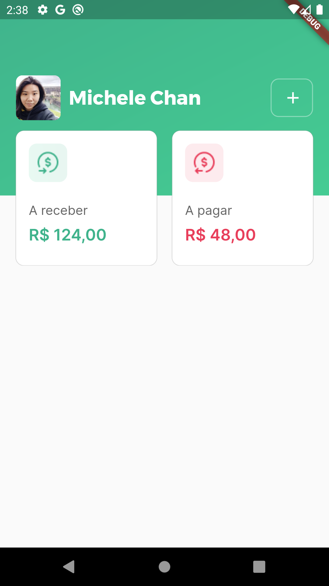

# split_it

Desafio 03 - Construindo AppBar

## Sobre o desafio

Criar a AppBAr da Home que foi definida no Figma, seguinto o layout: 
- [Figma](https://www.figma.com/file/QONeHwDgzkOhADLuZB997Q/split.it?node-id=0%3A1)

## Resultado 

  

